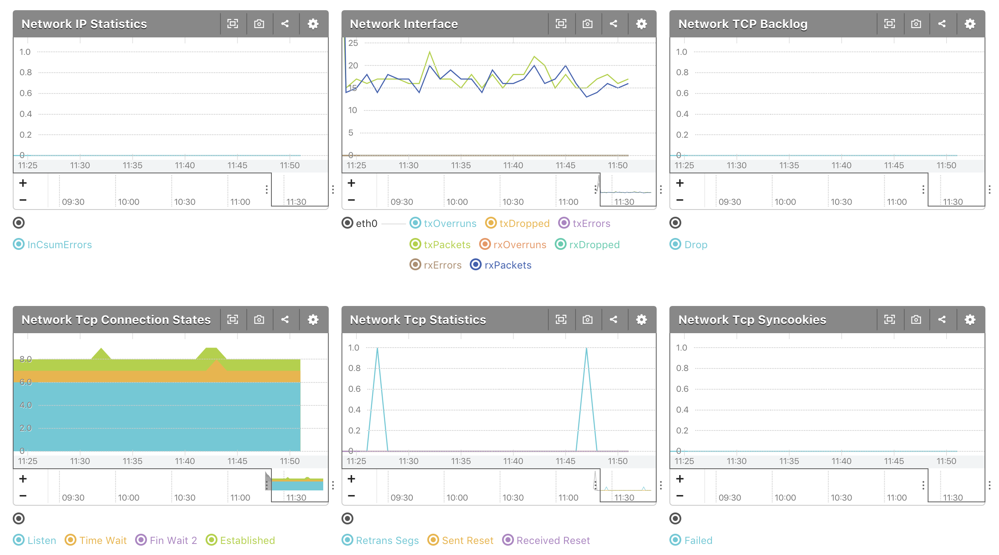

# mackerel-plugin-network

Network plugin for mackerel.io agent. This repository releases an artifact to Github Releases, which satisfy the format for mkr plugin installer.

## Install

```shell
mkr plugin install y-kuno/mackerel-plugin-network 
```

## Synopsis

```shell
mackerel-plugin-network [-metric-key-prefix=<prefix>]
```

## Example of mackerel-agent.conf

```
[plugin.metrics.network]
command = "/path/to/mackerel-plugin-network"
```

## Screenshot
